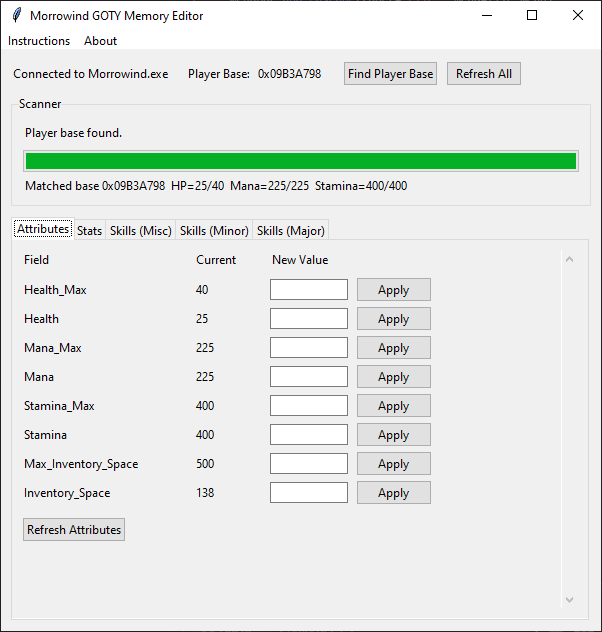

# Morrowind GOTY Memory Editor



Version agnostic, should work with any Morrowind version.

## Usage

**Step 1:** The game must be running and a character loaded. Save your game and pause the game.

**Step 2:** Click "Find Player Base" and enter the values requested. It will take a minute or two to scan the game memory for the player data blocks.

**Step 3:** Change the values you want.

**Step 4:** Back in the game, save the game again, load the saved game, and your changed values are visible.

**Step 5:** You can close the memory editor now.

## Requirements

- Python 3.x
- [pymem](https://github.com/srounet/Pymem)
- [numpy](https://numpy.org/)

## Installation

```bash
pip install -r requirements.txt
```

## Run

```bash
python main.py
```


## Credits

~ coded by non-npc
